# <h2 align="center">WTMESSANGER</h2>

- Messanger - це веб-додаток типу соціальної мережі, створений для спілкування та взаємодії між користувачами в реальному часі. Основна мета — надати сучасну соціальну платформу, де можна:
    - Обмінюватися повідомленнями завдяки WebSocket-з'єднанню.
    - Створювати пости — ділитися думками, ідеями, зображеннями або посиланнями.
    - Знаходити друзів — формувати список контактів, слідкувати за активністю знайомих.
    - Кастомізувати свій профіль — змінювати аватар, ім'я, фонове зображення, щоб зробити сторінку унікальною.
- Проєкт створений з метою глибшого ознайомлення з можливостями фреймворку Django, а також для практичного застосування сучасних вебтехнологій, наприклад AJAX для асинхронної взаємодії з сервером без перезавантаження сторінки. 

- Проєкт буде корисним тим, хто хоче спробувати себе у створенні повноцінного вебзастосунку з широким функціоналом. Він стане в пригоді тим, хто хоче навчитись працювати з фреймворком Django, для тих хто цікавиться веб розробкою, бажає створити власну соціальну мережу. Цей проєкт — чудова основа для тих, хто хоче розвиватися як *Full-Stack* розробник, поєднуючи бекенд і фронтенд розробку.

## КАТАЛОГ
* [Структура проєкту](#діаграма-структура-проєкту)
* [Як запустити проєкт локально?](#локальний-запуск-проєкту)
* [Налаштування віртуального оточення](#локальний-запуск-проєкту)
* [Запуск проєкту](#локальний-запуск-проєкту)

### Діаграма-структура проєкту

```mermaid
    graph TD;
    C{WTMessanger}
    C --> A[**core_app**<br>Додаток, який відповідає за головну сторінку: відображення постів, основна інформація профілю користувача]
    C --> B[**messanger_app**<br>Сторінка, що відповідає за обмін повідомленнями, створення групових та персональних чатів]
    C --> D[**post_app**<br>Додаток обробляє створення, редагування та відображення постів, додавання тегів, медіа та посилань]
    C --> E[**user_app**<br>Застосунок з багатьма сторінками, відповідає за реєстрацію, авторизацію, створення профілю, пошук друзів]
    C --> F[**media/**<br>Папка для збереження основних зображень користувачів, в нашому випадку - зображення постів]
    C --> G[**static/**<br>Загальні стилі для base шаблону]
    C --> H[**templates/**<br>Базовий шаблон, містить усі потрібні блоки]
    C --> I[**manage.py**<br>Основний файл для керування проєкту - локальний сервер, міграції, shell]
    C --> J[**WTMessanger**<br>Головний застосунок з налаштуваннями проєкту; обробка синхронних або асинхронних запитів; налаштування статичних та media файлів; налаштування локального чи глобального запуску проєкту]

    A --> A1[admin.py<br>Файл для реєстрації моделей в адмін - панелі]
    A --> A2[forms.py<br>Файл надає можливість створювати форми, кастомізувати їх, додавати нові поля]
    A --> A3[models.py<br>Створення моделей]
    A --> A4[views.py<br>Формування логіки відображення сторінок — через функції або класи представлення]
    A --> A5[urls.py<br>В цьому файлі вказується маршртизація застосункців - усі url сторінок]
    A --> A6[templates/<br>Папка для шаблонів - сторінок]
    A --> A7[static/<br>Папка для статичних файлів - css, js, images]

    B --> B1[consumers.py<br>обробка websocket-подій. Файл є аналогом views.py для асинхронного підключення]
    B --> B2[routing.py<br>налаштування маршрутизації websocket-з'єднання. Файл є аналогом urls.py]

    J --> J1[settings.py<br>Це основний файл, який Django використовує для запуску та роботи сайту]
    J --> J2[asgi.py<br>Цей файл потрібен для запуску проєкту через ASGI-сервер та обробки асинхронних запитів]
```

### Локальний запуск проєкту

---

#### Windows
1. *Створіть папку, де буде зберігатись проєкт*  
   > mkdir Messanger

2. *Перейдіть в створену папку*  
   > cd Messanger
   
3. *Склонуйте посилання на репозиторій проєкту. Його можна отримати з Git Hub репозиторію проєкту, натиснувши кнопку Code. В Git Bush терміналі пропишіть вказану команду, вона клонує проєкт у задану папку*  
   > git clone <url>

4. *Створіть віртуальне середовище для подальшого збереження туди потрібних модулів*  
   > python -m (назва віртуального середовища) venv — *створюємо віртуальне середовище*  
   > (назва віртуального середовища)\Scripts\ activate — *активуємо віртуальне середовище за вказаним шляхом*

5. *Встановіть файл requirements.txt (текстовий файл з усіма необхідними модулями для запуску проєкту)*  
   > pip install -r requirements.txt

6. *Перейдіть у папку проєкту - WTMessanger, де знаходиться основний файл manage.py, щоб запустити проєкт в роботу*  
   > cd WTMessanger

7. *Створіть та проведіть міграції бази даних. Міграції — каталог з будь-якими змінами, внесеними в БД користувачем*  
   > python manage.py makemigrations — *створюємо каталог міграцій*  
   > python manage.py migrate — *застосовуємо ці міграції до бази даних, створюючи/змінюючи таблиці*

8. *Запустіть файл manage.py в роботу*  
   > python manage.py runserver

---

#### MacOS
1. *Створіть папку, де буде зберігатись проєкт*  
   > mkdir Messanger

2. *Перейдіть в створену папку*  
   > cd Messanger

3. *Склонуйте посилання на репозиторій проєкту. Його можна отримати з Git Hub репозиторію проєкту, натиснувши кнопку Code. В Git Bush терміналі пропишіть вказану команду, вона клонує проєкт у задану папку*  
   > git clone <url>

4. *Створіть віртуальне середовище для подальшого збереження туди потрібних модулів*  
   > python3 -m (назва віртуального середовища) venv — *створюємо віртуальне середовище*  
   > source (назва віртуального середовища)\bin\ activate — *активуємо віртуальне середовище за вказаним шляхом*

5. *Встановіть файл requirements.txt (текстовий файл з усіма необхідними модулями для запуску проєкту)*  
   > pip3 install -r requirements.txt

6. *Перейдіть у папку проєкту - WTMessanger, де знаходиться основний файл manage.py, щоб запустити проєкт в роботу*  
   > cd WTMessanger

7. *Створіть та проведіть міграції бази даних. Міграції — каталог з будь-якими змінами, внесеними в БД користувачем*  
   > python3 manage.py makemigrations — *створюємо каталог міграцій*  
   > python3 manage.py migrate — *застосовуємо ці міграції до бази даних, створюючи/змінюючи таблиці*

8. *Запустіть файл manage.py в роботу*  
   > python3 manage.py runserver

### Особливості розробки