# <h2 align="center">WTMESSANGER</h2>


- Messanger - це веб-додаток типу соціальної мережі, створений для спілкування та взаємодії між користувачами в реальному часі. Основна мета — надати сучасну соціальну платформу, де можна:
    - Обмінюватися повідомленнями завдяки WebSocket-з'єднанню.
    - Створювати пости — ділитися думками, ідеями, зображеннями або посиланнями.
    - Знаходити друзів — формувати список контактів, слідкувати за активністю знайомих.
    - Кастомізувати свій профіль — змінювати аватар, ім'я, фонове зображення, щоб зробити сторінку унікальною.
- Проєкт створений з метою глибшого ознайомлення з можливостями фреймворку Django, а також для практичного застосування сучасних вебтехнологій, наприклад AJAX для асинхронної взаємодії з сервером без перезавантаження сторінки. 

- Проєкт буде корисним тим, хто хоче спробувати себе у створенні повноцінного вебзастосунку з широким функціоналом. Він стане в пригоді тим, хто хоче навчитись працювати з фреймворком Django, для тих хто цікавиться веб розробкою, бажає створити власну соціальну мережу. Цей проєкт — чудова основа для тих, хто хоче розвиватися як *Full-Stack* розробник, поєднуючи бекенд і фронтенд розробку.

## КАТАЛОГ
* [Структура проєкту](#діаграма-структура-проєкту)
* [Як запустити проєкт локально?](#локальний-запуск-проєкту)
* [Налаштування віртуального оточення](#локальний-запуск-проєкту)
* [Запуск проєкту](#локальний-запуск-проєкту)


### Діаграма-структура проєкту

```mermaid
    graph TD;
    C{WTMessanger}
    C --> A[**core_app**<br>Додаток, який відповідає за головну сторінку: відображення постів, основна інформація профілю користувача]
    C --> B[**messanger_app**<br>Сторінка, що відповідає за обмін повідомленнями, створення групових та персональних чатів]
    C --> D[**post_app**<br>Додаток обробляє створення, редагування та відображення постів, додавання тегів, медіа та посилань]
    C --> E[**user_app**<br>Застосунок з багатьма сторінками, відповідає за реєстрацію, авторизацію, створення профілю, пошук друзів]
    C --> F[**media/**<br>Папка для збереження основних зображень користувачів, в нашому випадку - зображення постів]
    C --> G[**static/**<br>Загальні стилі для base шаблону]
    C --> H[**templates/**<br>Базовий шаблон, містить усі потрібні блоки]
    C --> I[**manage.py**<br>Основний файл для керування проєкту - локальний сервер, міграції, shell]
    C --> J[**WTMessanger**<br>Головний застосунок з налаштуваннями проєкту; обробка синхронних або асинхронних запитів; налаштування статичних та media файлів; налаштування локального чи глобального запуску проєкту]

    A --> A1[admin.py<br>Файл для реєстрації моделей в адмін - панелі]
    A --> A2[forms.py<br>Файл надає можливість створювати форми, кастомізувати їх, додавати нові поля]
    A --> A3[models.py<br>Створення моделей]
    A --> A4[views.py<br>Формування логіки відображення сторінок — через функції або класи представлення]
    A --> A5[urls.py<br>В цьому файлі вказується маршртизація застосункців - усі url сторінок]
    A --> A6[templates/<br>Папка для шаблонів - сторінок]
    A --> A7[static/<br>Папка для статичних файлів - css, js, images]

    B --> B1[consumers.py<br>обробка websocket-подій. Файл є аналогом views.py для асинхронного підключення]
    B --> B2[routing.py<br>налаштування маршрутизації websocket-з'єднання. Файл є аналогом urls.py]

    J --> J1[settings.py<br>Це основний файл, який Django використовує для запуску та роботи сайту]
    J --> J2[asgi.py<br>Цей файл потрібен для запуску проєкту через ASGI-сервер та обробки асинхронних запитів]
```

### Локальний запуск проєкту

---

#### Windows
1. *Створіть папку, де буде зберігатись проєкт*  
   > <span style="color: rgb(40, 114, 40);">mkdir</span> Messanger

2. *Перейдіть в створену папку*  
   > <span style="color: rgb(40, 114, 40);">cd</span> Messanger
   
3. *Склонуйте посилання на репозиторій проєкту. Його можна отримати з Git Hub репозиторію проєкту, натиснувши кнопку Code. В Git Bush терміналі пропишіть вказану команду, вона клонує проєкт у задану папку*  
   > git <span style="color: rgb(40, 114, 40)">clone</span> <url>

4. *Створіть віртуальне середовище для подальшого збереження туди потрібних модулів*  
   > python -m (назва віртуального середовища) <span style="color: rgb(40, 114, 40)">venv</span> — *створюємо віртуальне середовище*  
   > (назва віртуального середовища)\Scripts\ <span style="color: rgb(40, 114, 40)">activate</span> — *активуємо віртуальне середовище за вказаним шляхом*

5. *Встановіть файл requirements.txt (текстовий файл з усіма необхідними модулями для запуску проєкту)*  
   > pip install -r <span style="color: rgb(40, 114, 40)">requirements.txt</span>

6. *Перейдіть у папку проєкту - WTMessanger, де знаходиться основний файл manage.py, щоб запустити проєкт в роботу*  
   > cd WTMessanger

7. *Створіть та проведіть міграції бази даних. Міграції — каталог з будь-якими змінами, внесеними в БД користувачем*  
   > python manage.py <span style="color: rgb(40, 114, 40)">makemigrations</span> — *створюємо каталог міграцій*  
   > python manage.py <span style="color: rgb(40, 114, 40)">migrate</span> — *застосовуємо ці міграції до бази даних, створюючи/змінюючи таблиці*

8. *Запустіть файл manage.py в роботу*  
   > python manage.py <span style="color: rgb(40, 114, 40)">runserver</span>

---

#### MacOS
1. *Створіть папку, де буде зберігатись проєкт*  
   > <span style="color: rgb(40, 114, 40);">mkdir</span> Messanger

2. *Перейдіть в створену папку*  
   > <span style="color: rgb(40, 114, 40);">cd</span> Messanger

3. *Склонуйте посилання на репозиторій проєкту. Його можна отримати з Git Hub репозиторію проєкту, натиснувши кнопку Code. В Git Bush терміналі пропишіть вказану команду, вона клонує проєкт у задану папку*  
   > git <span style="color: rgb(40, 114, 40)">clone</span> <url>

4. *Створіть віртуальне середовище для подальшого збереження туди потрібних модулів*  
   > python3 -m (назва віртуального середовища) <span style="color: rgb(40, 114, 40)">venv</span> — *створюємо віртуальне середовище*  
   > <span style="color: rgb(40, 114, 40)">source</span> (назва віртуального середовища)\bin\ <span style="color: rgb(40, 114, 40)">activate</span> — *активуємо віртуальне середовище за вказаним шляхом*

5. *Встановіть файл requirements.txt (текстовий файл з усіма необхідними модулями для запуску проєкту)*  
   > pip3 install -r <span style="color: rgb(40, 114, 40)">requirements.txt</span>

6. *Перейдіть у папку проєкту - WTMessanger, де знаходиться основний файл manage.py, щоб запустити проєкт в роботу*  
   > cd WTMessanger

7. *Створіть та проведіть міграції бази даних. Міграції — каталог з будь-якими змінами, внесеними в БД користувачем*  
   > python3 manage.py <span style="color: rgb(40, 114, 40)">makemigrations</span> — *створюємо каталог міграцій*  
   > python3 manage.py <span style="color: rgb(40, 114, 40)">migrate</span> — *застосовуємо ці міграції до бази даних, створюючи/змінюючи таблиці*

8. *Запустіть файл manage.py в роботу*  
   > python3 manage.py <span style="color: rgb(40, 114, 40)">runserver</span>

---

### Особливості розробки
#### Робота із зображеннями

У проєкті реалізована можливість завантаження, відображення та обробки зображень користувачів.  
- Користувачі можуть додавати зображення до своїх постів.  
- Зображення зберігаються у визначеній директорії на сервері - папці media.   

```python
# Файл models.py
from django.db import models

class Post(models.Model): # створюємо модель Post - таблицю в базі даних, для збереження даних постів
    title = models.CharField(max_length=200) # поле, що зберігає назву поста зі строковим типом даних
    image = models.ImageField( # поле для збереження файлів/зображень
        upload_to = 'posts_images/', # папка у MEDIA_ROOT, куди буде завантажено файл зображення
        blank = True, # поле необов’язкове для заповнення у формах (можна залишити порожнім)
        null = True  # у базі даних це поле може бути NULL (відсутність значення)
    ) 
```

<!--  -->
---

#### Робота з WebSocket запитами

- WebSocket -  це технологія, яка дозволяє обробляти асинхронні запити між браузером користувача та сервером, використовується для побудови додатків в реальному часі **(real-time)**, де дані оновлюються одразу без необхідності перезавантаження сторінки.  

- На відміну від звичайного HTTP протоколу, де кожен запит до сервера вимагає нового з'єднання, WebSockets встановлюють постійне двостороннє з'єднання, що дозволяє серверу надсилати дані клієнту одразу ж, коли вони стають доступними.

- Для роботи з WebSockets у django зазвичай використовують пакети **channels** і **daphne**.
    - `channels` - модуль забезпечує розширення стандартного django ASGI-сервера, дозволяючи працювати з асинхронними протоколами. Дає можливість створювати WebSocket-запити, працювати з каналами (channels) і групами каналів.
    - `daphne` - Відповідає за прийом та обробку запитів протоколів, які підтримує ASGI (WebSocket, HTTP/1, HTTP/2). Іншими словами, це сервер, який запускає django проект і приймає WebSocket-з'єднання в асинхронному режимі.
    
- Основні файли і їх призначення
    `asgi.py` - файл приймає та обробляє асинхронні запити.
    ```python
    # Задаємо змінну середовища, щоб Django знав, де шукати налаштування проекту
    os.environ.setdefault('DJANGO_SETTINGS_MODULE', 'WTMessanger.settings')

    # Створюємо головний ASGI-додаток, який прийматиме всі асинхронні запити
    application = ProtocolTypeRouter({
        # Обробляємо звичайні HTTP-запити через стандартний Django додаток
        'http': get_asgi_application(),

        # Обробляємо WebSocket-з'єднання, додаємо авторизацію користувача (щоб знати, хто підключений)
        'websocket': AuthMiddlewareStack( 
            # Задаємо список адрес (URL), на які можуть підключатися клієнти.
            URLRouter(routing.ws_urlpatterns)
        )
    })
    ```

    `consumers.py` - файл працює, коли користувач підключається, відправляє чи отримує повідомлення через WebSocket-з'єднання.
    ```python
    # Створюємо клас ChatConsumer — він обробляє WebSocket-з’єднання між клієнтом і сервером
    class ChatConsumer(AsyncWebsocketConsumer):
        # Метод connect викликається автоматично, коли клієнт намагається підключитися 
        async def connect(self):
            # Отримуємо ідентифікатор групи з URL, наприклад /chat/5 → group_id = 5
            self.group_id = str(self.scope['url_route']['kwargs']['group_id'])

            # Додаємо поточного користувача (його канал) до вказаної групи
            await self.channel_layer.group_add(
                self.group_id,
                self.channel_name
            )
            # Підтверджуємо підключення клієнта 
            await self.accept()
        # Метод receive викликається, коли клієнт надсилає повідомлення на сервер
        async def receive(self, text_data):
            # Зберігаємо повідомлення в базу даних і отримуємо об'єкт збереженого повідомлення
            saved_message = await self.save_message(text_data)

            # Відправляємо повідомлення всім користувачам у цій групі
            await self.channel_layer.group_send(
                self.group_id,  # Назва групи, якій відправляється повідомлення
                {
                    "type": "send_message_to_chat", # метод, який обробить цю подію
                    "text_data": text_data, # сам текст повідомлення (у JSON-форматі)
                    "username": self.scope["user"].username,  # ім'я користувача, який надіслав повідомлення
                    "datetime": saved_message.date_time.isoformat(), # час створення повідомлення у форматі ISO
                }
            )
    ```
    `routing.py` - у файлі вказано, які адреси WebSocket куди “підключати” — хто обробляє повідомлення на кожній адресі.
    ```python
    # Створюємо список посилань для WebSocket-з’єднань
    ws_urlpatterns = [
        # Вказуємо шлях WebSocket для чату з <group_id> — номером групи
        # ChatConsumer буде відповідати за обробку з’єднання в асинхронному режимі.
        path("chat/<int:group_id>", ChatConsumer.as_asgi())
    ]
    ```

--- 

#### Принцип роботи додатку post_app 

```python
# Клас CreatePostView відповідає за сторінку створення нового поста.
# Використовуємо LoginRequiredMixin, щоб лише авторизовані користувачі могли створювати пости.
class CreatePostView(LoginRequiredMixin, CreateView):
    model = Post  # Модель, з якою працює ця форма (Post)
    form_class = PostForm  # Форма, яка використовується для створення поста
    template_name = 'post/create_post.html'  # HTML-шаблон, який буде відображений
    success_url = reverse_lazy('core')  # Куди перенаправити після успішного створення поста

    def get(self, request: HttpRequest):
        # Отримуємо профіль поточного користувача
        profile = request.user.profile
        # Отримуємо аватар користувача
        avatar = Avatar.objects.filter(profile=profile, active=True, shown=True).first()
        # Отримуємо всі пости цього користувача, впорядковані від найновіших
        all_posts = Post.objects.filter(author=request.user.profile).order_by('-id')

        if request.user.is_authenticated:
            # Якщо користувач авторизований — відображаємо сторінку створення поста з усіма даними
            return render(request, self.template_name, context={
                'username': request.user.email,
                'first_name': request.user.first_name,
                'last_name': request.user.last_name,
                'avatar': avatar,
                'form': PostForm(), # Порожня форма для нового поста
                'posts': all_posts  # Усі наявні пости користувача
            })

        # Якщо не авторизований — просто рендеримо шаблон (можливо, з обмеженим функціоналом)
        return render(request, self.template_name)

    def post(self, request: HttpRequest):
        # Обробка форми після натискання кнопки "Опублікувати"
        form = PostForm(request.POST, request.FILES)
        # Якщо форма пройшла валідацію, відображаємо сторінку постів
        if form.is_valid():
            # Створюємо об'єкт поста, але ще не зберігаємо в базі (commit=False)
            post = form.save(commit=False)
            post.author = request.user.profile  # Прив'язуємо пост до користувача

            # Обробляємо поле content
            content = form.cleaned_data.get('content')
            # Забираємо всі слова, які не починаються з "#" (тобто залишаємо звичайний текст)
            post.content = ' '.join(word for word in content.split() if not word.startswith('#'))
            post.save()

            # Обробляємо теги
            for word in content.split():
                if word.startswith('#') and len(word) > 1: # startswith - якщо починається із '#' 
                    tag = Tag.objects.get_or_create(name= word[1:])[0] # зберігаємо тег без '#'
                    # word[1:] - зріз, беремо слово від 1 ел-ту і до кінця
                    # тег: #tag1 --> зберігаємо в бд: tag1 ((name= word[1:])[0])
                    # get_or_create() - повертає 2 об'єкти: сам тег і булеве значення, тому [0] - тег
                    post.tags.add(tag)

            # Обробляємо картинки
            # Отримуємо список завантажених файлів з input[name="images"]
            uploaded_files = request.FILES.getlist('images')
            post_images = []

            for file in uploaded_files:
                # Створюємо об'єкт зображення (Image) для кожного файлу
                post_image = Image.objects.create(
                    filename=file.name,
                    file=file
                )
                post_images.append(post_image)

            # Зберігаємо зображення, прив’язавши їх до поста
            post.images.set(post_images)

            # Обробляємо посилання
            # Отримуємо всі введені посилання з input[name="links"]
            links = request.POST.getlist('links')
            for link in links:
                if link.strip():  # Перевірка, щоб не було порожніх рядків
                    Link.objects.create(
                        post=post,
                        url=link
                    )
            # Отримуємо оновлений список постів після створення
            all_posts = Post.objects.filter(author=request.user.profile).order_by('-id')
            avatar = Avatar.objects.filter(profile=request.user.profile, active=True, shown=True).first()
```
---

#### Технологія AJAX

- `AJAX` (Asynchronous JavaScript and XML) — це технологія, що дозволяє додати текст, зображення, css файл, все що завгодно, на сторінку, або надіслати дані з форми на сторінці, при цьому не перезавантажуючи її.

> [!WARNING]
> У нашому проєкті ми поки що не використовували AJAX, але ця технологія точно стане у пригоді в майбутньому. 

##### Приклад використання у випадку натискання кнопки і відображення тексту.

1. Створюємо базову структуру: кнопку, та 2 пусті div-елементи, які при натисканні кнопки наповнюються даними
```html
<a href="#" id="ajax-add-post">Add post</a>
<div id="more-text-here1"></div>
```

2. Прописуємо JavaScript (jQuery) AJAX-запит
```javascript
// Функція, яка виконується після повного завантаження сторінки (DOM)
$(document).ready(function () {
    // Додаємо обробник події "click" на посилання з id "ajax-add-post"
    $("#ajax-add-post").click(function (e) {
        e.preventDefault(); // блокуємо стандартну дію посилання - оновлення

        // AJAX-запит до сервера
        $.ajax({
            type: 'GET', // Тип запиту — GET (отримати дані)
            async: true, // Вказуємо, що запит виконується асинхронно
            url: '/ajax/', // URL-адреса на сервері, яка обробляє запит
            data: { param1: 'value1' }, // Параметри, які передаємо (об'єкт або рядок)
            dataType: 'json', // Вказуємо, що очікуємо відповідь у форматі JSON
            success: function (data) {
                // Якщо отримана успішна відповідь від сервера — додаємо текст до блоку
                $("#more-text-here1").append(data['first-text'])
            },
            error: function (xhr, status, error) {
                // Якщо ж отримана помилка, виводмо її у консоль
                console.error("Помилка AJAX-запиту: ", error)
            }
        })
    })
})
```
---

#### Принцип роботи реєстрації та авторизації користувача
##### Як працює основний функціонал?
> [views.py](WTMessanger/user_app/views.py)
- `Реєстрація`: користувач заповнює форму реєстрації, після чого створюється обліковий запис з неактивним статусом. На пошту користувача надсилається 6-значний код підтвердження.

- `Підтвердження коду`: користувач вводить отриманий код, який порівнюється з кодом у базі. Якщо код правильний, обліковий запис активується.

- `Авторизація`: активований користувач може увійти в систему через форму логіну.

- `Деталі користувача`: після першого входу, якщо у користувача відсутні ім'я або прізвище, користувачеві пропонується заповнити додаткову інформацію для профілю.

